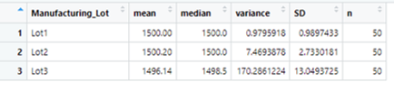

# MechaCar_Statistical_Analysis

## Linear Regression to Predict MPG

-Question 1: Which variables/coefficients provided a non-random amount of variance to the mpg values in the dataset?
As seen from the summary report of the linear model, the variables/coefficients provided a non-random amount of variance to the mpg values in the dataset were the intercept, vehicle length, and ground clearance.
-Question 2: Is the slope of the linear model considered to be zero? Why or why not?
No the slope cannot be considered equal to zero based on a p-value: 5.35e-11. We can thus reject the null hypothesis that the slope is equal to zero.
-Question 3: Does this linear model predict mpg of MechaCar prototypes effectively? Why or why not?
Yes, Based on the R2 value of 0.71, this linear model is effective in predicting the MPG because it is over the 5% threshold for accuracy. 

## Summary Statistics on Suspension Coils

###Summary Statistics on the Whole Dataset

###Summary Statistic on each lot

-Question :The design specifications for the MechaCar suspension coils dictate that the variance of the suspension coils must not exceed 100 pounds per square inch. Does the current manufacturing data meet this design specification for all manufacturing lots in total and each lot individually? Why or why not?
When we take a look at the summary statistics for the entire dataset, the variance = 62.29 which is withing the tolerance establised by the manufacturing design specifications.    However, when we break it down by the manufacturing lots, we can see that the previous variance of the entire dataset was strongly skewed byt eh cariance in lot 3 which is not within the design specifications.  
