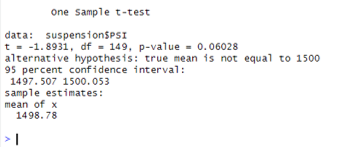
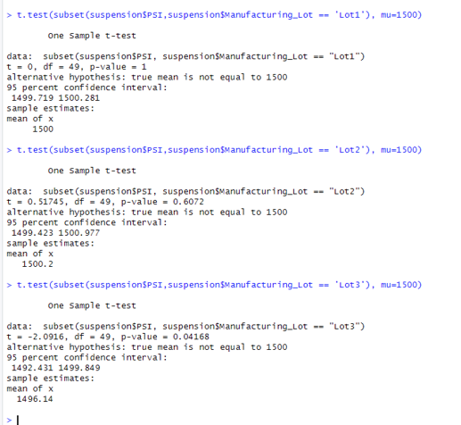

# MechaCar_Statistical_Analysis

## Linear Regression to Predict MPG

-Question 1: Which variables/coefficients provided a non-random amount of variance to the mpg values in the dataset?
As seen from the summary report of the linear model, the variables/coefficients provided a non-random amount of variance to the mpg values in the dataset were the intercept, vehicle length, and ground clearance.

-Question 2: Is the slope of the linear model considered to be zero? Why or why not?
No the slope cannot be considered equal to zero based on a p-value: 5.35e-11. We can thus reject the null hypothesis that the slope is equal to zero.

-Question 3: Does this linear model predict mpg of MechaCar prototypes effectively? Why or why not?
Yes, Based on the R2 value of 0.71, this linear model is effective in predicting the MPG because it is over the 5% threshold for accuracy. 

## Summary Statistics on Suspension Coils

###Summary Statistics on the Whole Dataset

###Summary Statistic on each lot

-Question :The design specifications for the MechaCar suspension coils dictate that the variance of the suspension coils must not exceed 100 pounds per square inch. Does the current manufacturing data meet this design specification for all manufacturing lots in total and each lot individually? Why or why not?

When we take a look at the summary statistics for the entire dataset, the variance = 62.29 which is withing the tolerance establised by the manufacturing design specifications.    However, when we break it down by the manufacturing lots, we can see that the previous variance of the entire dataset was strongly skewed by the variance in lot 3 which is not within the design specifications.  

## T-Tests on Suspension Coils

We tested each lot's sample mean against the population mean of 1500 PSI and discovered the following:
Lot 1 and 2 suggests that there is a signifcant relationship between the variables being tested and enough evidence to reject the null hypothesis.   The p-value of lot 1 & 2 were 100% and 60%.    The p-value of lot 3 was under 5% suggesting that there may not be enough evidence to reject the null hypothesis.  

## Study Design: MechaCar vs Competition

In quantifying how MechaCar performs against the competition i believe that the most important consumer preferences are price, fuel-efficiency, safety-ratings and maintenance costs.    The testing will need to be seperated by class in order to get an accurate representation of comparison.  The null hypothesis is that MechaCar out performs the competitiion with lower cost, better fuel-efficiency, better safety ratings and lower maintence costs.   The alternative hypothesis is tha the competition out performs MechaCar with lower cost, better fuel-efficiency, better safety ratings and lower maintence costs.   Performing t-test between the two groups on each category by class will provide a depiction of whether to reject the null hypothesis.  Gathering the per class average for price, fuel-efficiency, safety-ratings and maintenance costs for both MechaCar and the competitor would be necessary in order to run these tests.  

